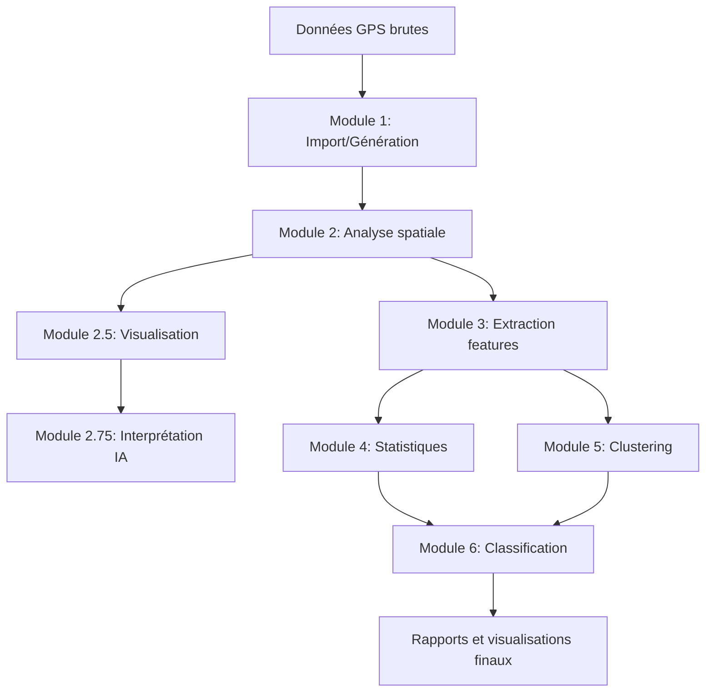

# 🗺️ ArcheoPatterns-GPS Framework

**Analyse spatiale et apprentissage automatique pour l'archéologie du paysage**

[]()
[]()
[]()

---

## 📖 Description

ArcheoPatterns-GPS est un framework d'analyse spatiale destiné à l'étude des patterns de distribution archéologique. Il combine des méthodes statistiques classiques (Nearest Neighbor Analysis, Ripley's K-function) avec des techniques modernes d'apprentissage automatique pour :

- 🔍 Identifier des patterns spatiaux dans les sites archéologiques
- 📊 Extraire des features significatives pour la classification
- 🤖 Appliquer du clustering et de la classification supervisée
- 📈 Visualiser et interpréter les résultats
- ⚖️ Respecter les principes éthiques de la recherche archéologique

## 🎯 Objectifs du projet

### Objectifs scientifiques
- Développer une méthodologie reproductible pour l'analyse spatiale archéologique
- Tester l'applicabilité du machine learning aux données de prospection
- Contribuer aux débats méthodologiques en archéologie quantitative

### Objectifs pratiques
- Fournir un outil open-source pour les archéologues
- Faciliter l'interprétation de données GPS de terrain
- Automatiser l'analyse de grands volumes de données spatiales

## 🏗️ Architecture du framework

```
📦 ArcheoPatterns-GPS
│
├── 📄 DOCUMENTATION/          # Documentation académique et technique
│   ├── Document_Académique_Complet.md
│   ├── Section_Ethique.md
│   ├── Méthodologie.md
│   └── Guide_Utilisation.md
│
├── 🐍 CODE/                   # Modules Python du pipeline
│   ├── Module_1_Generator.py         # Génération/Import de données
│   ├── Module_2_Analyzer.py          # Analyse spatiale (NNA, Ripley's K)
│   ├── Module_2.5_Visualizer.py      # Visualisation des patterns
│   ├── Module_2.75_AI_Interpreter.py # Interprétation assistée par IA
│   ├── Module_3_Feature_Extractor.py # Extraction de caractéristiques
│   ├── Module_4_Statistical_Analyzer.py # Analyses statistiques
│   ├── Module_5_Clustering.py        # Clustering non-supervisé
│   └── Module_6_Classifier.py        # Classification supervisée
│
├── 📚 RÉFÉRENCES/             # Bibliographie et ressources
│   └── Bibliographie.md
│
├── 📊 DONNÉES/                # Datasets et résultats
│   ├── Sites_Synthétiques.csv
│   ├── Features_Extracted.csv
│   └── Résultats_Tests.json
│
└── 💡 NOTES/                  # Notes de recherche
    ├── Ideas_Recherche.md
    ├── TODO_List.md
    └── Questions.md
```

## 🔄 Pipeline d'analyse



## 🚀 Démarrage rapide

### Prérequis

```bash
Python >= 3.8
numpy
pandas
scipy
scikit-learn
matplotlib
seaborn
geopandas (optionnel)
```

### Installation

```bash
# Cloner le projet
git clone [URL_DU_REPO]
cd ArcheoPatterns-GPS

# Installer les dépendances
pip install -r requirements.txt

# Vérifier l'installation
python -c "import numpy, pandas, scipy; print('Installation réussie!')"
```

### Utilisation basique

```python
# Exemple d'analyse spatiale simple
from CODE.Module_2_Analyzer import NearestNeighborAnalysis

# Charger vos données
sites = load_gps_data("DONNÉES/Sites_Synthétiques.csv")

# Analyser les patterns
nna = NearestNeighborAnalysis(sites)
results = nna.compute()

print(f"R-index: {results['R']}")
print(f"Pattern détecté: {results['pattern']}")
```

Voir [`Guide_Utilisation.md`](DOCUMENTATION/Guide_Utilisation.md) pour des exemples détaillés.

## 📊 Fonctionnalités principales

### ✅ Implémenté
- ✓ Nearest Neighbor Analysis (NNA)
- ✓ Ripley's K-function
- ✓ Génération de données synthétiques
- ✓ Visualisation des distributions spatiales
- ✓ Extraction de features spatiales

### 🚧 En développement
- ⏳ Clustering hiérarchique et DBSCAN
- ⏳ Classification Random Forest et SVM
- ⏳ Interface de visualisation interactive
- ⏳ Export des résultats en formats standardisés

### 🔮 Prévu
- 📅 Intégration avec QGIS
- 📅 Support des données raster (LiDAR)
- 📅 Analyses temporelles (chronologie)
- 📅 Module de prédiction de sites potentiels

## ⚖️ Considérations éthiques

Ce projet s'inscrit dans une démarche éthique rigoureuse :

- **Respect des communautés** : Principes CARE (Collective benefit, Authority to control, Responsibility, Ethics)
- **Transparence méthodologique** : Code open-source et documentation complète
- **Protection des données sensibles** : Anonymisation des localisations précises
- **Reproductibilité** : Protocoles détaillés et données synthétiques disponibles

Voir [`Section_Ethique.md`](DOCUMENTATION/Section_Ethique.md) pour plus de détails.

## 📚 Documentation

| Document | Description |
|----------|-------------|
| [Document académique complet](DOCUMENTATION/Document_Académique_Complet.md) | Article scientifique principal |
| [Méthodologie](DOCUMENTATION/Méthodologie.md) | Protocoles détaillés |
| [Guide d'utilisation](DOCUMENTATION/Guide_Utilisation.md) | Tutoriels et exemples |
| [Section éthique](DOCUMENTATION/Section_Ethique.md) | Cadre éthique du projet |

## 🤝 Contributions

Les contributions sont les bienvenues ! Domaines prioritaires :

- 🐛 Signalement de bugs
- 📖 Amélioration de la documentation
- 🧪 Ajout de tests unitaires
- 🌍 Support de nouvelles régions géographiques
- 🔬 Nouvelles méthodes d'analyse

Veuillez consulter `CONTRIBUTING.md` (à venir) pour les guidelines.

## 📄 Licence

[À définir - Licence open-source recommandée : MIT, GPL-3.0, ou CC-BY-SA]

## 📧 Contact

**Auteur principal** : [Votre nom]  
**Institution** : [Votre institution]  
**Email** : [Votre email]  
**ORCID** : [Votre ORCID si applicable]

## 🙏 Remerciements

Ce projet s'appuie sur les travaux fondateurs de :
- Clarke (1977) - Analyse spatiale en archéologie
- Ripley (1977) - K-function
- UNESCO (2021) - Éthique de la recherche archéologique
- Wylie (2002) - Épistémologie archéologique

Voir [`Bibliographie.md`](RÉFÉRENCES/Bibliographie.md) pour la liste complète.

## 📈 Statut du projet

**Version actuelle** : 0.1.0-alpha  
**Dernière mise à jour** : Novembre 2025  
**Statut** : Recherche active et développement

---

*"L'archéologie du paysage rencontre la science des données"*

